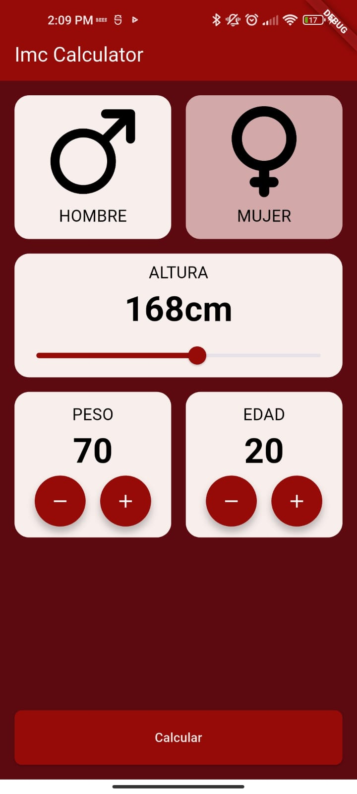
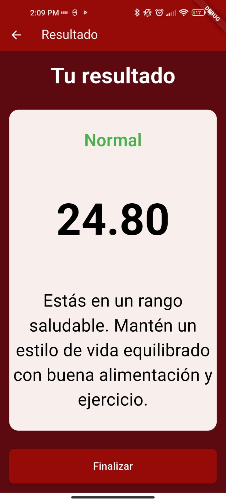

# 📱 IMC Calculator App

Una aplicación básica para calcular el **Índice de Masa Corporal (IMC)** desarrollada con **Flutter y Dart**.

## ✨ Características
- 📊 **Cálculo de IMC** basado en altura y peso.  
- 👫 **Selección de género** (masculino/femenino).  
- 📏 **Ajuste de altura, peso y edad** mediante controles intuitivos.  
- 🎨 **Interfaz simple y fácil de usar**.  

## 🛠️ Tecnologías utilizadas
- **Flutter**  
- **Dart**  


## 📸 Capturas de pantalla  

<div align="center">
  
  
</div>
## 🚀 Cómo ejecutar el proyecto  
1. Clona este repositorio:  
   ```bash
   git clone https://github.com/CristhofA/flutter_application_1